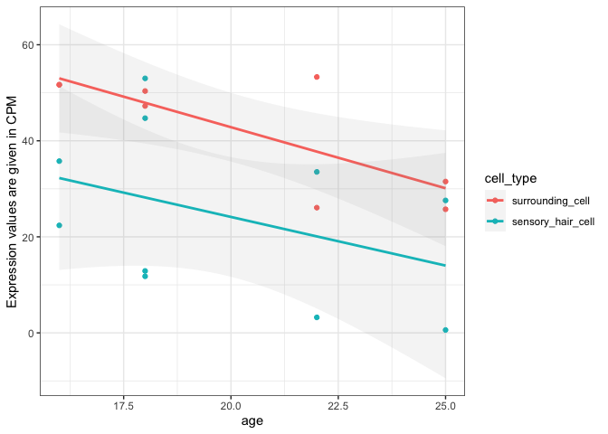
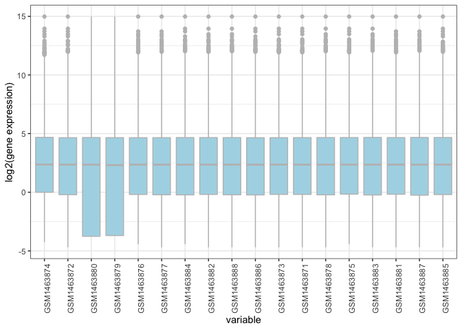
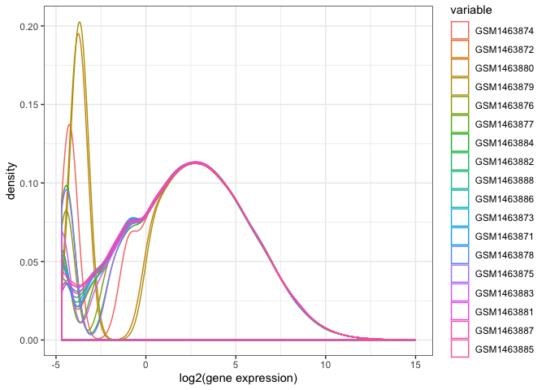
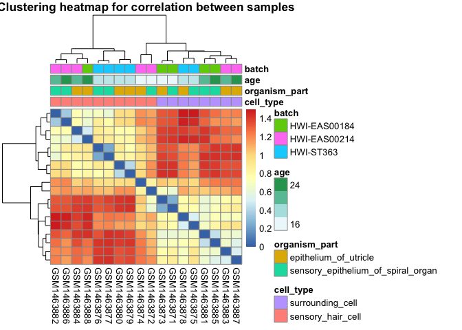
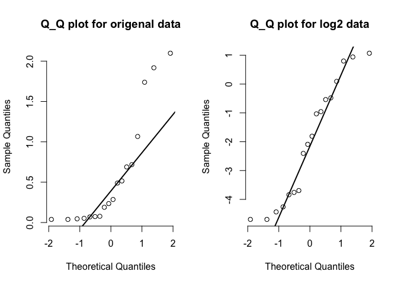

Analysis Assignment
================
Lily Xia

## Question 1: Data Inspection and Basic Manipulation

### Q1.1 Importing the data and getting familiar with it (2 POINT)

`gene_data` is the transcriptomic data, and `meta_data` stores the
samples metadata.

``` r
gene_data <- readRDS("gse60019_expression_matrix.RDS")
meta_data <- readRDS("gse60019_experiment_design.RDS")
```

There are 14479 unique genes from 18 samples in the given expression
matrix. In the sample metadata, there are 4 variables for the 18
samples, including `organism_part`, `cell_type`, `time_point` and
`batch`. These 4 variables are all in factor class. The levels for each
variable are listed below:

``` r
dat <- meta_data[,-1]
data.frame(variable = names(dat),
           class = sapply(dat, class),
           levels = sapply(dat, function(x) paste0(levels(x),  collapse = ", ")),
           row.names = NULL) %>% 
kable()
```

| variable       | class  | levels                                                          |
| :------------- | :----- | :-------------------------------------------------------------- |
| organism\_part | factor | epithelium\_of\_utricle, sensory\_epithelium\_of\_spiral\_organ |
| cell\_type     | factor | surrounding\_cell, sensory\_hair\_cell                          |
| time\_point    | factor | E16, P0, P4, P7                                                 |
| batch          | factor | HWI-EAS00184, HWI-EAS00214, HWI-ST363                           |

### Q1.2 Data manipulation (2 POINTS)

Create an new column in the samples metadata tibble to store the numeric
`age` values which are converted from the `time_point` column. From the
[Mouse Timeline Detailed
website](https://embryology.med.unsw.edu.au/embryology/index.php/Mouse_Timeline_Detailed),
we can see that `E16` is Day 16 in week. Since we assume that the mouse
gestation length is 18, `P0` is Day 18, `P4` is Day 22, `P7` is Day 25.
Here I only show 4 representative rows from the whole datatable due to
the room limit.

``` r
# initial assumption for gestation length
a <- 18
meta_data$age <- ifelse(meta_data$time_point %>% substring(1,1) == "E",
                        as.numeric(meta_data$time_point %>% str_extract("\\d+")),
                        as.numeric(meta_data$time_point %>% str_extract("\\d+")) + a)
# sample rows picking
meta_data[c(1,5,7,18),] %>% kable()
```

| sample     | organism\_part                         | cell\_type          | time\_point | batch        | age |
| :--------- | :------------------------------------- | :------------------ | :---------- | :----------- | --: |
| GSM1463874 | epithelium\_of\_utricle                | sensory\_hair\_cell | E16         | HWI-EAS00214 |  16 |
| GSM1463876 | sensory\_epithelium\_of\_spiral\_organ | sensory\_hair\_cell | P0          | HWI-ST363    |  18 |
| GSM1463884 | epithelium\_of\_utricle                | sensory\_hair\_cell | P4          | HWI-EAS00214 |  22 |
| GSM1463885 | sensory\_epithelium\_of\_spiral\_organ | surrounding\_cell   | P7          | HWI-EAS00184 |  25 |

### Q1.3 Single gene graphing (3 POINTS)

``` r
vegfa <- gene_data[gene_data$gene == "Vegfa",]
melt_vegfa <- vegfa %>% melt(id.vars = "gene",
                             var = "sample")
full_vegfa <- right_join(melt_vegfa, meta_data, by = "sample")
full_vegfa %>% 
  ggplot(aes(x = age, y = value, color = cell_type)) +
  geom_point() +
  geom_smooth(method='lm', alpha = 0.1) +
  theme_bw() +
  labs(y = "Expression values are given in CPM")
```

<!-- -->

From the scatterplot of age and expression values in CPM, two linear
regression lines based on different cell types are parallel. According
to this characteristics, there is no sign of interaction between cell
type and age for Vegfa.

## Question 2: Assessing overall data quality

### Q2.1 Overall distributions (4 POINTS)

We first convert the gene expression values to its log2 transform.

``` r
gene <- gene_data$gene
log2_gene <- as.data.frame(cbind(gene, round(log2(gene_data[,-1]),4)))

meltlog2_gene <- log2_gene %>% melt(id = "gene")
```

And show the boxplot and density plot of log2 gene expression values for
each sample.

``` r
meltlog2_gene %>%
  ggplot(aes(x = variable, y = value)) +
  geom_boxplot(color= "grey", fill="lightblue") +
  theme_bw() +
  theme(axis.text.x = element_text(angle = 90, hjust = 1)) +
  labs(y = "log2(gene expression)")
```

<!-- -->

Boxplot shows that the gene `GSM1463880` and `GSM1463879` are quite
different from others, it has wider spread.

``` r
meltlog2_gene %>% 
  ggplot(aes(x = value, color = variable)) +
  geom_density() +
  theme(axis.text.x = element_text(angle = 90, hjust = 1)) +
  labs(x = "log2(gene expression)") +
  theme_bw() 
```

<!-- --> Based on
the distribution of log2 expression values, the gene `GSM1463880` and
`GSM1463879` in yellow are different from the reat, which confirms what
we have in boxplot.

### Q2.2 How do the samples correlate with one another? (4 POINTS)

We standardize the log2 transformed gene expression value and call it
`stdDat`. Display `cell_type`, `organism_part`, `age`, `batch` as
annotations.

``` r
stdDat <- t(scale(t(log2_gene[,-1])))
preDat <- as.data.frame(meta_data[, c("cell_type", "organism_part", "age", "batch")])
rownames(preDat) <- meta_data$sample 

data_to_plot <- as.dist(1-cor(stdDat))
data_to_plot <- as.matrix(data_to_plot)
pheatmap(data_to_plot, cluster_rows = T, scale =  "none" , clustering_method = "ward.D2",
         clustering_distance_cols = "euclidean", show_colnames = T, show_rownames = F, 
         main = "Clustering heatmap for correlation between samples",
         annotation = preDat)
```

<!-- -->

Among all annotations, cell types seems to be the most strongly
correlated with clusters in gene expression data. Since we cluster the
correlation between samples, the highly correlated value will have a
closer distance. The off-diagonal has distance zero in the heatmap.
`GSM1463878` is the sample whose expression values correlate with the
samples of the different cell\_type.

## Question 3: Conducting differential expression analysis

### Q3.1 Remove lowly expressed genes (3 POINTS)

We first check the sample size in each treatment group (combination of
cell type and organism
part)

``` r
table(meta_data$cell_type, meta_data$organism_part) %>% kable()
```

|                     | epithelium\_of\_utricle | sensory\_epithelium\_of\_spiral\_organ |
| ------------------- | ----------------------: | -------------------------------------: |
| surrounding\_cell   |                       4 |                                      4 |
| sensory\_hair\_cell |                       5 |                                      5 |

The treatments with the smallest group size are surrounding cell and
epithelium of utricle combination, sensory hair cell and sensory
epithelium of spiral organ combination with group size 4. Now we check
the CPM whether it is greater than 1 for each gene expression value and
filter the genes with at least as many samples (\>1) as tje smallest
group size.

We create a function that input the smallest sample size that we have
function in the previous section and out the genes that have satisfied
the critieria.

``` r
filter_gene <- function(m){
  temp <- gene_data
  temp1 <- as.data.frame(gene_data[,-1] > 1)
  temp$num <- apply(temp1, 1, function(z)length(z[z == T]))
  temp2 <- temp %>% 
    filter(num > m)
  return(temp2)
}

nrow(filter_gene(4)) 
```

    ## [1] 12336

The number of genes reduced from 14479 to 12336 after filtering.

### Q3.2 Construct linear model (4 POINTS)

Reformat the data frame to only gene expression data with gene IDs as
row names.

``` r
lm_data <- as.data.frame(gene_data[,-1])
rownames(lm_data) <- gene
log_lm <- log(lm_data)
```

The reason that we use logCPM to fit the linear model is because the
data should satisfy the linear regression model assumption which is
normality of response/residual. Now we check the model assumption by
ramdomly select a gene and compare its expression values with and
without the log transformation.
<!-- -->

Clearly, the log transformation is used to make the linear model fit
more adequate on this gene expression data. Then we use `Limma` to fit
the linear model for each gene with cell type, organism part, age and
the interaction between age and cell type as
covariates.

``` r
DesMat <- model.matrix(~ cell_type + organism_part + age + age:cell_type, meta_data)
dsFit <- lmFit(log_lm, DesMat)
dsEbFit <- eBayes(dsFit)
dsHits <- topTable(dsEbFit)
dsHits %>% kable()
```

|          | cell\_typesensory\_hair\_cell | organism\_partsensory\_epithelium\_of\_spiral\_organ |         age | cell\_typesensory\_hair\_cell.age |     AveExpr |        F | P.Value | adj.P.Val |
| -------- | ----------------------------: | ---------------------------------------------------: | ----------: | --------------------------------: | ----------: | -------: | ------: | --------: |
| Tmem255b |                     7.2323527 |                                          \-0.8185087 |   0.0985444 |                       \-0.0413799 |   0.9532364 | 251.2692 |       0 |         0 |
| Mgat5b   |                     3.0744782 |                                            0.3321432 | \-0.0651029 |                         0.1037309 | \-0.1576954 | 210.0188 |       0 |         0 |
| Mmp2     |                     0.2728479 |                                          \-0.1094241 |   0.1150436 |                       \-0.1935492 |   2.4860194 | 157.1349 |       0 |         0 |
| Lhx3     |                     4.3617578 |                                          \-0.1767559 |   0.0112449 |                         0.0770417 |   0.1445746 | 137.2901 |       0 |         0 |
| Tmem178b |                     3.0773891 |                                            0.1971184 | \-0.0422408 |                         0.0994874 |   2.6297833 | 126.2731 |       0 |         0 |
| Mreg     |                     4.1004053 |                                            0.3374398 | \-0.1047154 |                         0.0292396 |   6.0963557 | 117.2482 |       0 |         0 |
| Nrsn1    |                     6.2743535 |                                            0.1622585 |   0.0369123 |                         0.0032845 |   1.4432677 | 110.3550 |       0 |         0 |
| Grxcr1   |                    10.9210980 |                                          \-0.0969361 |   0.2558461 |                       \-0.2070297 |   2.1141560 | 109.8142 |       0 |         0 |
| Pifo     |                     4.6345955 |                                          \-0.8199027 |   0.0689524 |                         0.0502691 |   0.0672445 | 108.0919 |       0 |         0 |
| Trim30d  |                     3.4333587 |                                          \-0.4895052 |   0.2738689 |                       \-0.3068628 | \-1.8239254 | 106.6446 |       0 |         0 |

These are the top 10 high-expressed genes selected by `limma` and
`eBayes`.

### Q3.3: Interpret model (2 POINTS)

To interprate the linear inference of the gene `Eva1a`, we first fitter
out the linear estimations of this gene

``` r
coeff <- as.data.frame(dsFit$coefficients)
coeff <- rownames_to_column(coeff)
t(coeff %>% 
  filter(gene == "Eva1a")) %>%  kable()
```

|                                                      |             |
| :--------------------------------------------------- | :---------- |
| rowname                                              | Eva1a       |
| (Intercept)                                          | 2.759541    |
| cell\_typesensory\_hair\_cell                        | \-3.596564  |
| organism\_partsensory\_epithelium\_of\_spiral\_organ | 1.384532    |
| age                                                  | \-0.1458939 |
| cell\_typesensory\_hair\_cell:age                    | 0.1197279   |

Here the reference in this model is surrounding cells and epithelium of
utricle, the `Eva1a` is more active in surrounding cells, comparing with
expression in hair cells; more active in spiral organ than epithelium of
utricle. As mouse ageing, the predicted expression changes of this gene
are
subtle.

## Question 4: Evaluating the results

### Q4.1: Quantifying the number of genes differentially expressed (3 POINTS)

Here we use the p-value adjusted method `fdr` that introduced by
Benjamini & Hochberg, which give strong control of the family-wise error
rate in multiple pairwise comparisons. Since we want the number of genes
with adjusted p-value reater than 0.05, we reset the maximum number of
henes to list as
14479

``` r
dsHits2 <- topTable(dsEbFit, number = 14479, adjust.method = "fdr", p.value = 0.05)
nrow(dsHits2)
```

    ## [1] 6364

We find that there are 6364 genes that differentially expressed by cell
type.

### Q4.2: Interpret the interaction term (3 POINTS)

### Bonus Question (2 POINTS)
