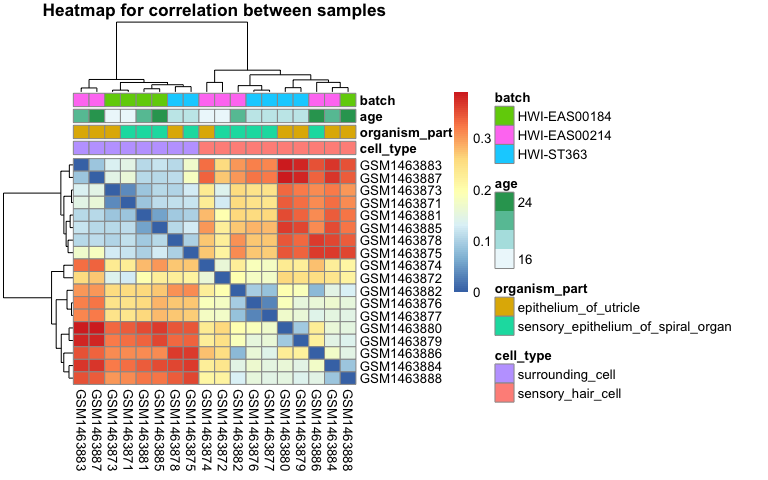

Analysis Assignment
================
Lily Xia

## Question 1: Data Inspection and Basic Manipulation

### Q1.1 Importing the data and getting familiar with it (2 POINT)

`gene_data` is the transcriptomic data, and `meta_data` stores the
samples metadata.

``` r
gene_data <- readRDS("gse60019_expression_matrix.RDS")
meta_data <- readRDS("gse60019_experiment_design.RDS")
```

There are 14479 unique genes from 18 samples in the given expression
matrix. In the sample metadata, there are 4 variables for the 18
samples, including `organism_part`, `cell_type`, `time_point` and
`batch`. These 4 variables are all in factor class. The levels for each
variable are listed below:

``` r
dat <- meta_data[,-1]
data.frame(variable = names(dat),
           class = sapply(dat, class),
           levels = sapply(dat, function(x) paste0(levels(x),  collapse = ", ")),
           row.names = NULL) %>% 
kable()
```

| variable       | class  | levels                                                          |
| :------------- | :----- | :-------------------------------------------------------------- |
| organism\_part | factor | epithelium\_of\_utricle, sensory\_epithelium\_of\_spiral\_organ |
| cell\_type     | factor | surrounding\_cell, sensory\_hair\_cell                          |
| time\_point    | factor | E16, P0, P4, P7                                                 |
| batch          | factor | HWI-EAS00184, HWI-EAS00214, HWI-ST363                           |

### Q1.2 Data manipulation (2 POINTS)

Create an new column in the samples metadata tibble to store the numeric
`age` values which are converted from the `time_point` column. From the
[Mouse Timeline Detailed
website](https://embryology.med.unsw.edu.au/embryology/index.php/Mouse_Timeline_Detailed),
we can see that `E16` is Day 16 in week. Since we assume that the mouse
gestation length is 18, `P0` is Day 18, `P4` is Day 22, `P7` is Day 25.
Here I only show 4 representative rows from the whole datatable due to
the room limit.

``` r
# initial assumption for gestation length
a <- 18
meta_data$age <- ifelse(meta_data$time_point %>% substring(1,1) == "E",
                        as.numeric(meta_data$time_point %>% str_extract("\\d+")),
                        as.numeric(meta_data$time_point %>% str_extract("\\d+")) + a)
# sample rows picking
meta_data[c(1,5,7,18),] %>% kable()
```

| sample     | organism\_part                         | cell\_type          | time\_point | batch        | age |
| :--------- | :------------------------------------- | :------------------ | :---------- | :----------- | --: |
| GSM1463874 | epithelium\_of\_utricle                | sensory\_hair\_cell | E16         | HWI-EAS00214 |  16 |
| GSM1463876 | sensory\_epithelium\_of\_spiral\_organ | sensory\_hair\_cell | P0          | HWI-ST363    |  18 |
| GSM1463884 | epithelium\_of\_utricle                | sensory\_hair\_cell | P4          | HWI-EAS00214 |  22 |
| GSM1463885 | sensory\_epithelium\_of\_spiral\_organ | surrounding\_cell   | P7          | HWI-EAS00184 |  25 |

### Q1.3 Single gene graphing (3 POINTS)

``` r
vegfa <- gene_data[gene_data$gene == "Vegfa",]
melt_vegfa <- vegfa %>% melt(id.vars = "gene",
                             var = "sample")
full_vegfa <- right_join(melt_vegfa, meta_data, by = "sample")
full_vegfa %>% 
  ggplot(aes(x = age, y = value, color = cell_type)) +
  geom_point() +
  geom_smooth(method='lm', alpha = 0.1) +
  theme_bw() +
  labs(y = "Expression values are given in CPM")
```

<!-- -->

From the scatterplot of age and expression values in CPM, two linear
regression lines based on different cell types are parallel. According
to this characteristics, there is no sign of interaction between cell
type and age for Vegfa.

## Question 2: Assessing overall data quality

### Q2.1 Overall distributions (4 POINTS)

We first convert the gene expression values to its log2 transform.

``` r
gene <- gene_data$gene
log2_gene <- as.data.frame(cbind(gene, round(log2(gene_data[,-1]),4)))

meltlog2_gene <- log2_gene %>% melt(id = "gene")
```

And show the boxplot and density plot of log2 gene expression values for
each sample.

``` r
meltlog2_gene %>%
  ggplot(aes(x = variable, y = value)) +
  geom_boxplot(color= "grey", fill="lightblue") +
  theme_bw() +
  theme(axis.text.x = element_text(angle = 90, hjust = 1)) +
  labs(y = "log2(gene expression)")
```

<!-- -->

Boxplot shows that the gene `GSM1463880` and `GSM1463879` are quite
different from others, it has wider spread.

``` r
meltlog2_gene %>% 
  ggplot(aes(x = value, color = variable)) +
  geom_density() +
  theme(axis.text.x = element_text(angle = 90, hjust = 1)) +
  labs(x = "log2(gene expression)") +
  theme_bw() 
```

<!-- --> Based on
the distribution of log2 expression values, the gene `GSM1463880` and
`GSM1463879` in yellow are different from the reat, which confirms what
we have in boxplot.

### Q2.2 How do the samples correlate with one another? (4 POINTS)

We standardize the log2 transformed gene expression value and call it
`stdDat`. Display `cell_type`, `organism_part`, `age`, `batch` as
annotations.

``` r
stdDat <- t(scale(t(log2_gene[,-1])))
preDat <- as.data.frame(meta_data[, c("cell_type", "organism_part", "age", "batch")])
rownames(preDat) <- meta_data$sample 

data_to_plot <- as.dist(1-cor(stdDat))
data_to_plot <- as.matrix(data_to_plot)
pheatmap(data_to_plot, cluster_rows = T, scale =  "none" , clustering_method = "ward.D2",
         clustering_distance_cols = "euclidean", show_colnames = T, show_rownames = F, 
         main = "Clustering heatmap for correlation between samples",
         annotation = preDat)
```

<!-- -->

Among all annotations, cell types seems to be the most strongly
correlated with clusters in gene expression data. Since we cluster the
correlation between samples, the highly correlated value will have a
closer distance. The off-diagonal has distance zero in the heatmap.
`GSM1463878` is the sample whose expression values correlate with the
samples of the different cell\_type.

## Question 3: Conducting differential expression analysis

### Q3.1 Remove lowly expressed genes (3 POINTS)

We first check the sample size in each treatment group (combination of
cell type and organism
part)

``` r
table(meta_data$cell_type, meta_data$organism_part) %>% kable()
```

|                     | epithelium\_of\_utricle | sensory\_epithelium\_of\_spiral\_organ |
| ------------------- | ----------------------: | -------------------------------------: |
| surrounding\_cell   |                       4 |                                      4 |
| sensory\_hair\_cell |                       5 |                                      5 |

The treatments with the smallest group size are surrounding cell and
epithelium of utricle combination and sensory hair cell and sensory
epithelium of spiral organ combination. Now we filter the genes with CPM
\> 1 in thses two groups and all genes in the rest treatment groups.

``` r
filter_gene <- function(m){
  r <- meta_data %>% 
  group_by(organism_part, cell_type) %>% 
  mutate(treatment_size = n()) %>% 
  filter(treatment_size == m) %>% 
  select(sample, cell_type, organism_part)
  
  g <- gene_data %>% select(c(gene, r$sample))
  h <- g[,-1] > 1
  g$num <- apply(h, 1, function(z)length(z[z == T]))
  r2 <- g %>% 
    filter(num > m) %>% 
    select(gene)
  dat <- left_join(r2,gene_data,by ="gene")
  return(dat)
}

nrow(filter_gene(4))
```

    ## [1] 10485

### Q3.2 Construct linear model (4 POINTS)

### Q3.3: Interpret model (2 POINTS)

## Question 4: Evaluating the results

### Q4.1: Quantifying the number of genes differentially expressed (3 POINTS)

### Q4.2: Interpret the interaction term (3 POINTS)

### Bonus Question (2 POINTS)
