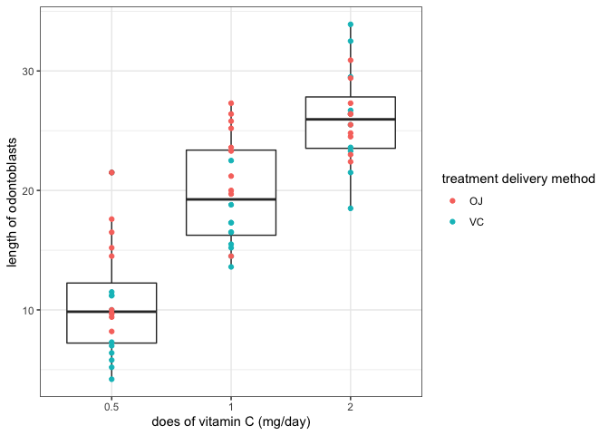

practice\_assignment
================
Lily Xia
24 January, 2020

## Data inspection with R (2pt)

``` r
dat <- data.frame(Titanic)
```

In this question we use dataset `Titanic`. This data set provides
information on the fate of passengers on the fatal maiden voyage of the
ocean liner ‘Titanic’, summarized according to economic status (class),
sex, age and survival.

A 4-dimensional array resulting from cross-tabulating 2201 observations
on 4 variables. The variables and their levels are as follows:

| No |   Name   |       Levels        |
| :-: | :------: | :-----------------: |
| 1  |  Class   | 1st, 2nd, 3rd, Crew |
| 2  |   Sex    |    Male, Female     |
| 3  |   Age    |    Child, Adult     |
| 4  | Survived |       No, Yes       |

### Passenger breakdown

``` r
# create a function to get total passenger 
# input : specific dataset 
# output: total passenger of the dataset

sumfreq <- function(x){
  sum(x$Freq)
}
```

``` r
children <- dat[dat$Age == "Child",]
adults <- dat[dat$Age == "Adult",]

sumfreq(children)
sumfreq(adults)

f_adults <- adults[adults$Sex == "Female",]
m_adults <- adults[adults$Sex == "Male",]
sumfreq(f_adults)
sumfreq(m_adults)
```

There were 109 children and 2092 adults. Among 2092 adults, 425 of them
were female adults and 1667 were male adults, so there were more male
adults than female adults.

### Survival

Survival rate is the percentage of people in a group still alive;
therefore the survial rate here could be expressed as: 

``` r
# create a function to calculate the survival rate
# input: sepcific dataset
# output: total number of passenger in the dataset
#         total number of survival passenger in the dataset
#         survival rate

survival_rate <- function(data){
  total <- sumfreq(data)
  survived <- sumfreq(data[data$Survived == "Yes",])
  rate <- sumfreq(data[data$Survived == "Yes",])/sumfreq(data)
  return(round(c(total, survived, rate),2))
}
```

``` r
survival_rate(children)
survival_rate(adults)
```

The survial rates among different age groups are:

  - The total number of chliren on the ship were 109 , and there were 57
    survived. The survival rate is \(0.52\%\).
  - The total number of Adult are 2092 , and there were 654 survived.
    The survival rate is \(0.31\%\).

Thus, children did have better survival rate than the adults.

``` r
first <- dat[dat$Class == "1st",]
second <- dat[dat$Class == "2nd",]
thrid <- dat[dat$Class == "3rd",]
crew <- dat[dat$Class == "Crew",]

survival_rate(first)
survival_rate(second)
survival_rate(thrid)
survival_rate(crew)
```

The survial rates among different classes are:

  - The total number of passenger in 1st class on the ship were 325 ,
    and there were 203 survived. The survival rate is \(62\%\).
  - The total number of passenger in 2nd class are 285 , and there were
    118 survived. The survival rate is \(41\%\).
  - The total number of passenger in 3rd class on the ship were 706 ,
    and there were only 178 survived. The survival rate is \(25\%\).
  - The total number of passenger in crew are 885 , and there were 212
    survived. The survival rate is \(24\%\).

Overall, 1st class class of passengers have a better survival rate.

## Data visualization (1.5pt)

We analysis the dataset about the effect of Vitamin C on tooth growth in
guinea pigs. The response is the *length of odontoblasts (cells
responsible for tooth growth)* in 60 guinea pigs. Each animal received
one of three dose levels of vitamin C (0.5, 1, and 2 mg/day) by one of
two delivery methods, orange juice or ascorbic acid (a form of vitamin C
and coded as VC).

``` r
dat2 <- read.table("guinea_pigs_tooth_growth.txt", header = T)
```

``` r
dat2 %>% 
  ggplot()+
  geom_boxplot(aes(x = factor(dat2$dose), y = dat2$len)) +
  geom_point(aes(x = factor(dat2$dose), y = dat2$len, color = factor(dat2$supp))) +
  xlab("does of vitamin C (mg/day)") +
  ylab("length of odontoblasts") +
  scale_color_discrete(name="treatment delivery method") +
  theme_bw()
```

<!-- -->

The data frame has 60 observations on 3 variables. To analysis the
effect of 3 different treatment (does level of the Vitamin C) on the
length of the odontoblasts, we compare 3 does levels. Two types of
treatment delivery method are blocking variables.

We use boxplot to compare 3 does levels, and we find as the does amont
increases the lenth of odontoblasts also increases, which means the does
levels might has significant effect on the tooth growth. Moreover, two
colours identify levels of the blocking variable. We find that the
orange juice method yeilds higher length than ascorbic acid. Thus, the
difference between two blocking levels might also be significant.
