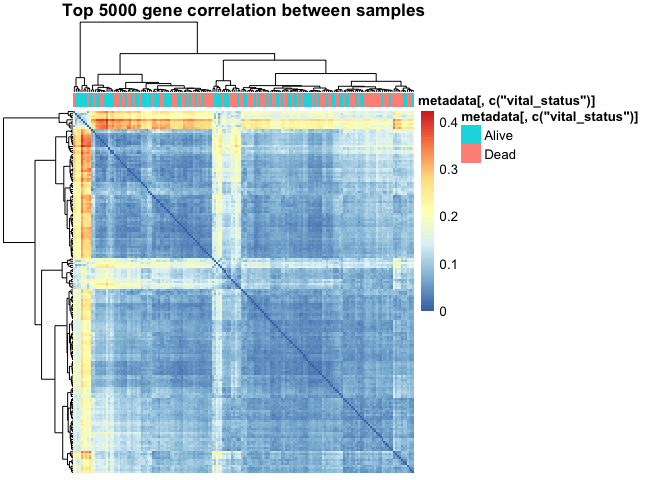
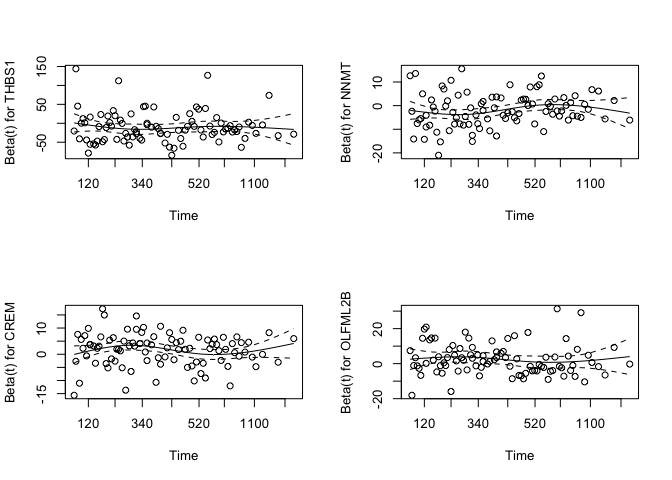
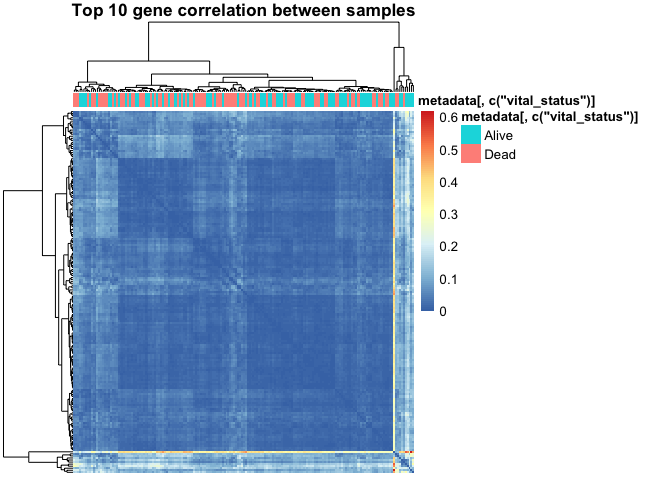
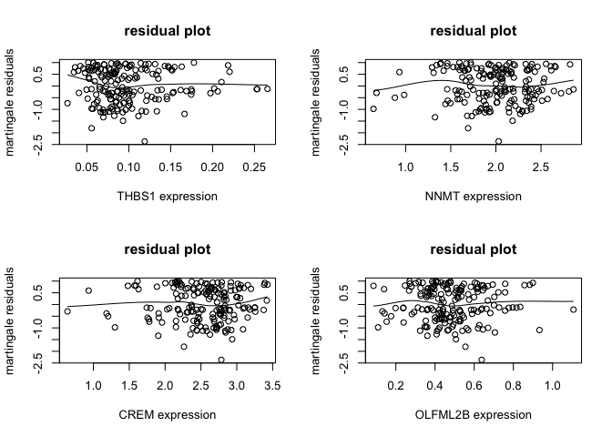

Group Project - Individual Report
================

Survival and Gene Expressions Analysis of Pancreatic adenocarcinoma
(PAAD)

## A concise summary of contributions of each group member (1 pts)

Group tasks were divided into five steps, including project topic
background information research, Data Dexcrption and Wrangling,
Exploratory Data Analysis (EDA), Modeliing Building, and results
interpretation. And our group members include Hassan Ali, Simran Samra,
Sophia Li and me. Hassian and Simran are from Biology background, and
one works in BC cancer and another has experience in Heart Lung
Innovation. Sophia and I are from Statistical background. Both of us
have strong data analysis coding stills but lack of the experience in
analyze high dimensional Genomic data.

Based on the each member’s academic backgroup, Hassan and Simran are
assigned to the background information research (“blue task”), on the
other hand, Sophia and I mainly focus on the model building (“yellow
task”). Data Dexcrption and Wrangling, EDA and results interpretation
(“green tasks”) were done all together.


“blue task”:

1.  research the backgroud of Pancreatic adenocarcinoma (PAAD) and
    introduce the topic to other group members
2.  evaluate whether group objectives are doable or not

“green task”:

1.  Data Description and Wrangling: decribe the data variables (gene
    data and metadata) and sanitize the data
2.  EDA: explore the data without any assumption. For instance, using
    density plots, boxplots and principal components analysis (PCA) to
    visualize the data and compare different cohort of subjects.
3.  Results interpratation: explain the EDA and statistical models
    outcome and summary analysis limitation

“yellow task”:

1.  survival analysis
2.  vital status classification
3.  Hypothesis test
4.  Clustering samples and genes

## Your specific contributions and comments (1 pts)

As the division of labor mentioned above, I mainly focused on data
cleaning and data modeling. Besides, I also helped to maintain the
Github repo. Overall, all tasks worked well but final results
interpration and limitation discussion were not as what I expected. From
my perspective, having members from genome or biology backgroud could
help us not only explane the results statistically, but also assists
us to think the results in different aspects. For example, although our
models shows there is no statistical significant between patients’ gene
expression and vital status, it does not mean there is no association
between them. Therefore, Besides using highly expressed genes, I hope I
could have more information on what genes we should mainly focus on based on backgroud research. 

This project provides us a really good hand-on experience to apply the approaches that we have learnt in
class and seminars. It was also fun to work with different background
students.

``` r
fit <- coxph(formula = Surv(time, vital_status) ~ THBS1 + NNMT + CREM + 
    OLFML2B, data = dat2)
summary(fit)
```

    ## Call:
    ## coxph(formula = Surv(time, vital_status) ~ THBS1 + NNMT + CREM + 
    ##     OLFML2B, data = dat2)
    ## 
    ##   n= 176, number of events= 92 
    ## 
    ##               coef  exp(coef)   se(coef)      z Pr(>|z|)   
    ## THBS1   -1.053e+01  2.661e-05  3.781e+00 -2.786  0.00534 **
    ## NNMT    -1.875e+00  1.533e-01  5.968e-01 -3.142  0.00168 **
    ## CREM     1.647e+00  5.193e+00  5.114e-01  3.221  0.00128 **
    ## OLFML2B  2.500e+00  1.218e+01  9.349e-01  2.673  0.00751 **
    ## ---
    ## Signif. codes:  0 '***' 0.001 '**' 0.01 '*' 0.05 '.' 0.1 ' ' 1
    ## 
    ##         exp(coef) exp(-coef) lower .95 upper .95
    ## THBS1   2.661e-05  3.758e+04 1.608e-08   0.04404
    ## NNMT    1.533e-01  6.523e+00 4.760e-02   0.49378
    ## CREM    5.193e+00  1.926e-01 1.906e+00  14.14846
    ## OLFML2B 1.218e+01  8.213e-02 1.948e+00  76.09318
    ## 
    ## Concordance= 0.635  (se = 0.034 )
    ## Likelihood ratio test= 23.08  on 4 df,   p=1e-04
    ## Wald test            = 22.06  on 4 df,   p=2e-04
    ## Score (logrank) test = 21.97  on 4 df,   p=2e-04

I found that increaseing the expression value of `THBS1`, `NNMT` will
decrease the log hazard ratio (longer survival time) by 10.53 and 1.875
respectively, but if increase the expression value of `CREM` and
`OLFML2B`, then log hazard ratio will increase 1.647 and 2.500
respectively. The Cox model diagnostics was performed as follow: We use
Martingale residual plot to check the functional form of the covariates
in the Cox model. A approximate straight line in each plot indicates
that a linear form is needed. We also check the constancy of the
coefficients using Schoenfeld residual against a nonlinear scale of time
with spline
smoother.

<!-- --><!-- -->

## Answer to one question specific to your project (3 points)

**Q: What is your rationale for mostly analyzing the top 10 genes, and
not for instance genes that pass FDR, or some other number of top genes?
How do you think this impacted your
results?**

``` r
(tptb <- toptable(ebfit)) %>% kable()
```

|               |       logFC |          t |   P.Value | adj.P.Val |          B |
| ------------- | ----------: | ---------: | --------: | --------: | ---------: |
| THBS1         | \-0.3383241 | \-3.121237 | 0.0018009 |  0.999918 | \-2.663375 |
| NNMT          | \-0.3298341 | \-3.042912 | 0.0023430 |  0.999918 | \-2.774369 |
| CREM          | \-0.3297327 | \-3.041977 | 0.0023503 |  0.999918 | \-2.775677 |
| CTD-2033D15.2 | \-0.3257617 | \-3.005341 | 0.0026528 |  0.999918 | \-2.826609 |
| OLFML2B       | \-0.3223433 | \-2.973805 | 0.0029413 |  0.999918 | \-2.869958 |
| CYP1B1        | \-0.3207618 | \-2.959214 | 0.0030843 |  0.999918 | \-2.889858 |
| KCNE4         | \-0.3200521 | \-2.952667 | 0.0031504 |  0.999918 | \-2.898757 |
| ITPRIP        | \-0.3196528 | \-2.948983 | 0.0031882 |  0.999918 | \-2.903754 |
| RP11-21L23.2  | \-0.3105856 | \-2.865333 | 0.0041657 |  0.999918 | \-3.015568 |
| CTGF          | \-0.3079740 | \-2.841239 | 0.0044939 |  0.999918 | \-3.047176 |

We have analysis a cohort of pancreatic adenocarcinoma (PAAD) patients
who were diagnosed between 2001 to 2014. There are 177 patients with
average follow-up 655 days. We consider the latest death as the endpoint
in the analysis. The patients were between the age of 35-88 years old.
To identify genes that are more heavily expressed in PAAD patients that
have longer survival time compared to those that have a shorter survival
time, we used `limma` and `eBayes` to model the relationship between
gene expression and vital status.

`lmFit()` function that we used carries out multiple linear regression
on each gene, where the explanatory variable was *vital\_status*. The
multiple linear regressions were conducted to evaluate the association
between gene expression values and patients’ survival situations.
Meanwhile, since we perform the statistical test on each gene, the the
dangerouse of multiple testing should be considered. We controled the
false discovery rate (FDR) using Benjamini Hochberg method, and
`adj.P.Val` is the BH FDR values given by default. We expected limma
could narrow down the range of genes.

However, all `adj.P.Val` are the same and close to 1. We’re not getting
any genes with adjusted p-values below 0.05, meaning that there is no
genes pass the FDR, and this data set doesn’t provide any differentially
expressed genes at a FDR threshold of 0.05.

<!-- -->

<!-- -->

<!-- -->

These are the heatmaps for different selected genes correlation between
samples. Since we cannot access the control cohort, the mutational
signature genes cannot be detected. The suggested mutational genes are
`KRAS`, `TP53`, `CDKN2A` and `SMAD4`. We can see that the shown sample
clusters in all heatmaps might not due to different vital status.

No matter what number of top genes used to analyze, `adj.P.Val` are
still constant and close to 1. However, an adjusted p-value of 1 doesn’t
mean there is no differential expression, it just means that this
particular data set does not show any evidence of differential
expression. The insufficient quality of the data set might because of
hidden batch effects obscuring the true effect or other errors that we
need to figure out.

The rationale for mostly analyzing the top 10 genes is not because the
target genes are 100 percent included in such a small range. But we
thought our first step of finding the evidence of differential
expression among 44,084 genes should start from the highly expressed
genes. Furthermore, we are not able to handle the full set of genes in
survival analysis, so top 10 genes maybe a good start. We use `step()`
function based on Akaike Information Criterion (AIC) to further select
genes in the top10, and fit the Cox porportional hazard model.
