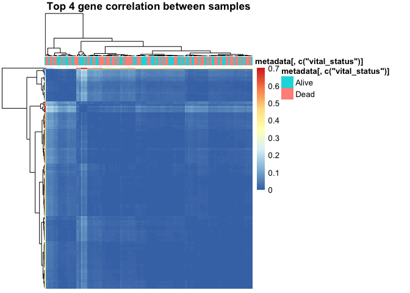
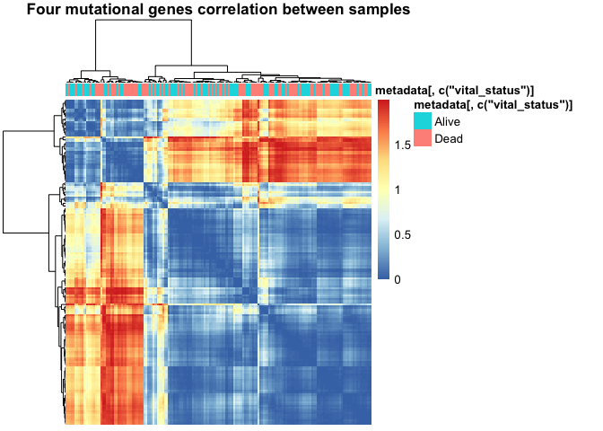

Individual Report
================

# Group Project - individual report:

Survival and Gene Expressions Analysis of Pancreatic adenocarcinoma
(PAAD)

## A concise summary of contributions of each group member (1 pts)

Group tasks were divided into five steps, including project topic
background information research, Data Dexcrption and Wrangling,
Exploratory Data Analysis (EDA), Modeliing Building, and results
interpretation. And our group members include Hassan Ali, Simran Samra,
Sophia Li and me. Hassian and Simran are from Biology background, and
one works in BC cancer and another has experience in Heart Lung
Innovation. Sophia and I are from Statistical background. Both of us
have strong data analysis coding stills but lack of the experience in
analyze high dimensional Genomic data.

Based on the each member’s academic backgroup, Hassan and Simran are
assigned to the background information research (“blue task”), on the
other hand, Sophia and I mainly focus on the model building (“yellow
task”). Data Dexcrption and Wrangling, EDA and results interpretation
(“green tasks”) were done all together.


“blue task”:

1.  research the backgroud of Pancreatic adenocarcinoma (PAAD) and
    introduce the topic to other group members
2.  evaluate whether group objectives are doable or not

“green task”:

1.  Data Description and Wrangling: decribe the data variables (gene
    data and metadata) and sanitize the data
2.  EDA: explore the data without any assumption. For instance, using
    density plots, boxplots and principal components analysis (PCA) to
    visualize the data and compare different cohort of subjects.
3.  Results interpratation: explain the EDA and statistical models
    outcome and summary analysis limitation

“yellow task”:

1.  survival analysis
2.  vital status classification
3.  Hypothesis test
4.  Clustering samples and genes

## Your specific contributions and comments (1 pts)

As mention above, I mainly focus on data cleaning and data analyzing.
Besides, I also help to maintain the Github repo. Overall, all tasks
worked well but final results interpration and limitation discussion
were not as what I expected. From my perspective, having members from
genome or biology backgroud could help us not only interprate the
results statistically, but also assist us to think the results in
different aspects. For example, I know that although our models shows
there is no statistical significant between patients’ gene expression
and vital status, it does not mean there is no association between them.
Therefore, In addition to highly expressed genes, I hope I could have
more information on what mutational genes we should mainly focus on
based on backgroud research. This project is really good hand-on
experience to apply the approaches that we have learnt in class and
seminars, and it’s fun to work with different background students.

## Answer to one question specific to your project (3 points)

What is your rationale for mostly analyzing the top 10 genes, and not
for instance genes that pass FDR, or some other number of top genes? How
do you think this impacted your results?

We find the the top4 genes, suggested mutational signature genes (Kras,
tp53, cdkn2a and smad4) and top 10 genes

``` r
preDat <- as.data.frame(metadata[, c("vital_status")])
rownames(preDat) <- metadata$submitter_id 

data_to_plot <- as.dist(1-cor(topFour))
data_to_plot <- as.matrix(data_to_plot)
pheatmap(data_to_plot, cluster_rows = T, scale =  "none" , clustering_method = "ward.D2",
         clustering_distance_cols = "euclidean", show_rownames = F, show_colnames = F,
         main = "Top 4 gene correlation between samples",
         annotation = preDat)
```

<!-- -->

``` r
data_to_plot <- as.dist(1-cor(mutFour))
data_to_plot <- as.matrix(data_to_plot)
pheatmap(data_to_plot, cluster_rows = T, scale =  "none" , clustering_method = "ward.D2",
         clustering_distance_cols = "euclidean", show_rownames = F, show_colnames = F,
         main = "Four mutational genes correlation between samples",
         annotation = preDat)
```

<!-- -->

``` r
data_to_plot <- as.dist(1-cor(topTen))
data_to_plot <- as.matrix(data_to_plot)
pheatmap(data_to_plot, cluster_rows = T, scale =  "none" , clustering_method = "ward.D2",
         clustering_distance_cols = "euclidean", show_rownames = F, show_colnames = F,
         main = "Top 10 gene correlation between samples",
         annotation = preDat)
```

<!-- -->

``` r
# Four mutational genes
meta_mut4$vital_status <- as.numeric(meta_mut4$vital_status)-1

coxph(Surv(time, vital_status) ~ KRAS + TP53 + CDKN2A + SMAD4, 
         data = meta_mut4)
```

    ## Call:
    ## coxph(formula = Surv(time, vital_status) ~ KRAS + TP53 + CDKN2A + 
    ##     SMAD4, data = meta_mut4)
    ## 
    ##           coef exp(coef) se(coef)      z      p
    ## KRAS    3.5642   35.3117   1.1086  3.215 0.0013
    ## TP53    0.6371    1.8910   0.7455  0.855 0.3928
    ## CDKN2A -1.8455    0.1579   0.8579 -2.151 0.0315
    ## SMAD4  -0.2044    0.8151   0.3192 -0.640 0.5220
    ## 
    ## Likelihood ratio test=15.32  on 4 df, p=0.004081
    ## n= 176, number of events= 92 
    ##    (1 observation deleted due to missingness)

``` r
# Top 4 gene
meta_gene4$vital_status <- as.numeric(meta_gene4$vital_status)-1

coxph(Surv(time, vital_status) ~ THBS1 + `CTD-2033D15.2` + NNMT + CREM, 
         data = meta_gene4)
```

    ## Call:
    ## coxph(formula = Surv(time, vital_status) ~ THBS1 + `CTD-2033D15.2` + 
    ##     NNMT + CREM, data = meta_gene4)
    ## 
    ##                       coef  exp(coef)   se(coef)      z       p
    ## THBS1           -9.877e+00  5.136e-05  3.746e+00 -2.637 0.00837
    ## `CTD-2033D15.2`  1.850e-01  1.203e+00  8.837e-01  0.209 0.83415
    ## NNMT             6.330e-01  1.883e+00  3.963e-01  1.597 0.11019
    ## CREM             4.756e-01  1.609e+00  4.491e-01  1.059 0.28961
    ## 
    ## Likelihood ratio test=10.47  on 4 df, p=0.03326
    ## n= 176, number of events= 92 
    ##    (1 observation deleted due to missingness)

``` r
# Top 10 gene
meta_gene10$vital_status <- as.numeric(meta_gene10$vital_status)-1

coxph(Surv(time, vital_status) ~ THBS1 + `CTD-2033D15.2` + NNMT + CREM + OLFML2B +
        CYP1B1 + KCNE4 + ITPRIP + `RP11-21L23.2` + CTGF, 
         data = meta_gene10)
```

    ## Call:
    ## coxph(formula = Surv(time, vital_status) ~ THBS1 + `CTD-2033D15.2` + 
    ##     NNMT + CREM + OLFML2B + CYP1B1 + KCNE4 + ITPRIP + `RP11-21L23.2` + 
    ##     CTGF, data = meta_gene10)
    ## 
    ##                       coef  exp(coef)   se(coef)      z       p
    ## THBS1           -1.171e+01  8.248e-06  4.238e+00 -2.762 0.00574
    ## `CTD-2033D15.2`  5.356e-01  1.709e+00  5.161e-01  1.038 0.29931
    ## NNMT            -1.922e+00  1.463e-01  6.242e-01 -3.080 0.00207
    ## CREM             1.800e+00  6.052e+00  6.229e-01  2.890 0.00385
    ## OLFML2B          2.807e+00  1.657e+01  1.178e+00  2.382 0.01720
    ## CYP1B1          -5.478e-01  5.782e-01  7.375e-01 -0.743 0.45761
    ## KCNE4           -7.426e-01  4.759e-01  5.684e-01 -1.307 0.19136
    ## ITPRIP           7.117e-01  2.037e+00  5.068e-01  1.404 0.16025
    ## `RP11-21L23.2`   1.663e-01  1.181e+00  1.533e+00  0.108 0.91361
    ## CTGF             7.167e-02  1.074e+00  9.337e-01  0.077 0.93881
    ## 
    ## Likelihood ratio test=27.37  on 10 df, p=0.002273
    ## n= 176, number of events= 92 
    ##    (1 observation deleted due to missingness)
