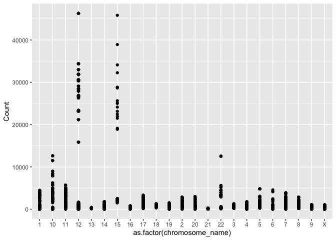
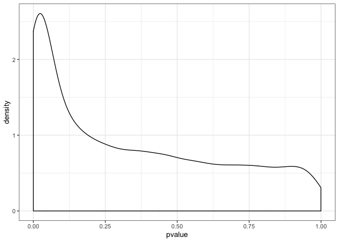

Seminar 3 - Data aggregation with dplyr
================
Yuan Xia
27/01/2020

``` r
# if (!requireNamespace("BiocManager", quietly = TRUE))
#    install.packages("BiocManager")
# 
# BiocManager::install("GEOquery")
# BiocManager::install("biomaRt")
library(GEOquery)
library(biomaRt)
library(tidyverse)
library(data.table)
library(reshape2)
```

Load the meta table and gene expression table from GEO

``` r
gds <- getGEO("GDS507")
meta_data <- data.frame(Sample = gds@dataTable@columns$sample, disease = gds@dataTable@columns$disease.state)
#we grab this info from the appropriate slots above. 

gds_data <- gds@dataTable@table
```

Explore the gene expression table and melt it from 19 columns to 4
columns.

``` r
nrow(gds_data)
ncol(gds_data)
melted_data <- melt(gds_data, id.vars = c("ID_REF", "IDENTIFIER"), var = "Sample")
head(melted_data)
```

Use dplyr function to modify the table.

``` r
melted_data %>% 
    group_by(Sample) %>% 
    summarize(mean = mean(value))
```

    ## # A tibble: 17 x 2
    ##    Sample    mean
    ##    <fct>    <dbl>
    ##  1 GSM11815  751.
    ##  2 GSM11832  742.
    ##  3 GSM12069  748.
    ##  4 GSM12083  735.
    ##  5 GSM12101  803.
    ##  6 GSM12106  744.
    ##  7 GSM12274  761.
    ##  8 GSM12299  802.
    ##  9 GSM12412  685.
    ## 10 GSM11810  765.
    ## 11 GSM11827  780.
    ## 12 GSM12078  774.
    ## 13 GSM12099  766.
    ## 14 GSM12269  710.
    ## 15 GSM12287  791.
    ## 16 GSM12301  770.
    ## 17 GSM12448  757.

``` r
new_melted_data <- melted_data %>% 
    group_by(Sample, IDENTIFIER) %>% 
    summarize(Count = mean(value))
```

## Part 2 - Exercise

Modify the above code to also identify the length of each gene captured
in the dataset we have been working with in the above exercises. This
can be done by adding “transcript\_length” as attribute in getBM
function. You should end up with an extra column for “transcript
length”. We will use this number later.

``` r
#open connection between biomaRt and R. 
human = useMart("ensembl", dataset = "hsapiens_gene_ensembl")
#function that takes in data frame, and outputs same data frame with associated chromosome annotations.
identify_gene_names <- function(df){
    names(df) <- c("Sample", "hgnc_symbol", "Count")
    names <- getBM(attributes=c("hgnc_symbol", "chromosome_name", "transcript_length"),
                  filters= "hgnc_symbol", 
                  values = unique(df$hgnc_symbol), 
                  mart = human)
    left_join(df, names, by = "hgnc_symbol")
}
data_with_chromosome <- identify_gene_names(new_melted_data) %>% 
    filter(chromosome_name %in% c(1:23, "X", "Y"))


identify_gene_name <- function(df){
    names(df) <- c("Sample", "hgnc_symbol", "Count")
    names <- getBM(attributes=c("hgnc_symbol", "chromosome_name"),
                  filters= "hgnc_symbol", 
                  values = unique(df$hgnc_symbol), 
                  mart = human)
    left_join(df, names, by = "hgnc_symbol")
}

data_without_length <- identify_gene_name(new_melted_data) %>% 
    filter(chromosome_name %in% c(1:23, "X", "Y"))
```

**Aim:** how the average expression of genes on the X chromosome changes
between RCC and normal cells.

The first thing we will do is combine information from the meta data
file (meta\_data) with our expression table
(data\_with\_chromosome).

``` r
#There's a lot of variation in how the chromosomal location is annotated. To simplify things, let's filter out all genes with annotations that are not numeric numbers between 1 and 23, X or Y. 

full_data <- left_join(data_with_chromosome, meta_data, by = "Sample")

full_data2 <- left_join(data_without_length, meta_data, by = "Sample")
```

Then we will use dplyr verbs to first group all samples by disease
status, filter out *all X-chromosome genes*, and then calcualte the mean
using summarize().

``` r
full_data %>% 
    group_by(disease) %>% 
    filter(chromosome_name == "X") %>% 
    summarize(mean = mean(Count))
```

    ## # A tibble: 2 x 2
    ##   disease  mean
    ##   <fct>   <dbl>
    ## 1 normal   818.
    ## 2 RCC      867.

Here the statistical summary changed from (686, 658) to (817,867) after
we added “transcript\_length”. I think the reason is that before adding
the “transcript\_length” there is no rows with same combination of
“chromosome\_name” and “hgnc\_symbol. However,
adding”transcript\_length" also add a different numbers of rows with
same combination of “chromosome\_name” and “hgnc\_symbol”. We should use
the `weighted.mean()` function where w represent the number of repeated
rows with same “chromosome\_aame” and “hgnc\_symbol” combination.

``` r
new_full_data <- full_data %>% 
    filter(chromosome_name == "X") %>% 
    group_by(.dots = c("Sample", 
                       "hgnc_symbol",
                       "chromosome_name",
                       "disease")) %>%
    mutate(n = 1/n())

new_full_data %>% 
    group_by(disease) %>% 
    filter(chromosome_name == "X") %>% 
    summarize(mean = weighted.mean(Count,n))
```

    ## # A tibble: 2 x 2
    ##   disease  mean
    ##   <fct>   <dbl>
    ## 1 normal   686.
    ## 2 RCC      658.

## Part 3- Graphing expression data

``` r
#choose random number between 1 and however many genes we have. 
set.seed(5747540)
sample_to_choose <- sample(1:length(unique(full_data$hgnc_symbol)), size = 100)
#choose genes that correspond to those numbers in a list of genes. 
names_to_choose <- as.character(unique(full_data$hgnc_symbol)[sample_to_choose])

full_data %>% 
    filter(hgnc_symbol %in% names_to_choose) %>% 
    group_by(Sample) %>% 
    ggplot(aes(x = as.factor(chromosome_name), y = Count)) + geom_point()
```

<!-- -->

By adding one additional function to the code above, calculate the sum
of all counts in each sample and divide each expression value by that
sum (hint: use mutate). Remember, you can add multiple new columns using
mutate by separating each column with a comma (i.e mutate(x = c(“a”,
“b”), y = c(“d”, “c”))). Plot this new transformed column.

For this question, it faces the same unequal repeats issue. Thus, we
just simply use the dataset without “transcript\_length”.

``` r
(full_data2 %>% 
  filter(hgnc_symbol %in% names_to_choose) %>% 
    group_by(Sample) %>% 
    mutate(Rate = Count/sum(Count)) %>% 
    mutate(sum_count = sum(Count)))
```

    ## # A tibble: 1,700 x 7
    ## # Groups:   Sample [17]
    ##    Sample   hgnc_symbol Count chromosome_name disease     Rate sum_count
    ##    <chr>    <chr>       <dbl> <chr>           <fct>      <dbl>     <dbl>
    ##  1 GSM11815 AFF4         556. 5               RCC     0.00432    128591.
    ##  2 GSM11815 AGPAT5       270. 8               RCC     0.00210    128591.
    ##  3 GSM11815 ANKRD18B     310. 9               RCC     0.00241    128591.
    ##  4 GSM11815 API5         176. 11              RCC     0.00137    128591.
    ##  5 GSM11815 ARAP1        127. 11              RCC     0.000986   128591.
    ##  6 GSM11815 ARID2        791. 12              RCC     0.00615    128591.
    ##  7 GSM11815 ART4         310. 12              RCC     0.00241    128591.
    ##  8 GSM11815 ASAP1       1922. 8               RCC     0.0149     128591.
    ##  9 GSM11815 BMPR1A       268. 10              RCC     0.00208    128591.
    ## 10 GSM11815 C14orf28     403. 14              RCC     0.00313    128591.
    ## # … with 1,690 more rows

## Part 4 - Analyzing the results of statistical tests

**Aim:** run statistical tests on the data. we want to identify the
genes that are differentially expressed between the normal and RCC
samples. We will use summarize() to perform a t-test for each gene.

``` r
plotdata <- full_data2 %>% 
    group_by(hgnc_symbol) %>% 
    summarize( pvalue = t.test(Count ~ disease)$p.value)

plotdata %>% 
  ggplot(aes(pvalue)) +
  geom_density() +
  theme_bw()
```

<!-- -->

The full\_data2 is the dataset without “transcript\_length”. From part 2
we have already proved that adding “transcript\_length” will influence
the gene expression count mean as there are different numbers of
repeated “count” measurement. T-statistics of T-test is based on the
sample mean, and if the sample is not accurate then the p-value from
t-statistics will also be influenced.

``` r
lowest_pvalue <- plotdata %>% 
  filter(pvalue < 0.05)
```
