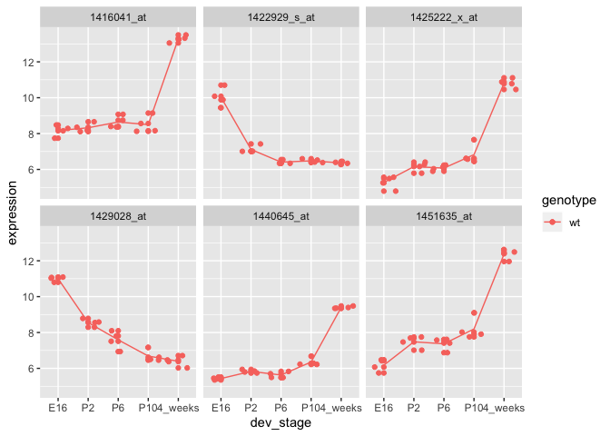
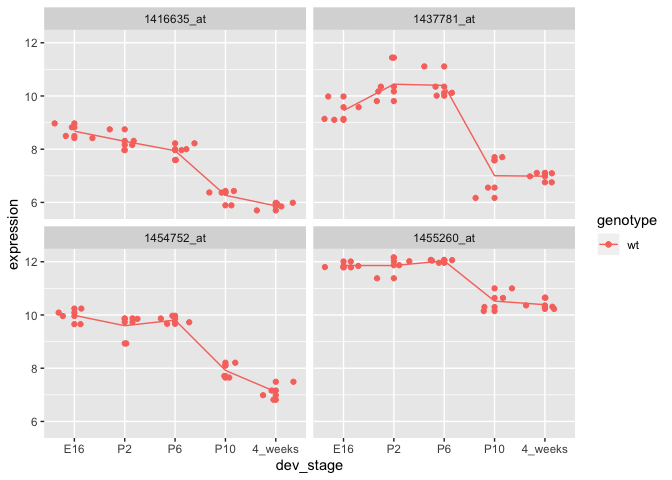
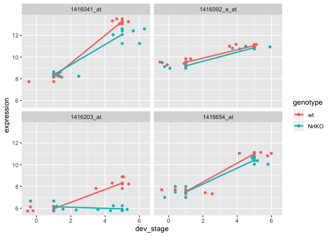

Seminar 4: Differential Expression Analysis
================
Yuan Xia
03 February, 2020

### Import data

``` r
# Expression Matrix

expressionMatrix <- read.table("https://raw.githubusercontent.com/STAT540-UBC/STAT540-UBC.github.io/master/seminars/seminars_winter_2020/seminar4/expression_data/GSE4051_data.tsv", 
                               stringsAsFactors = FALSE, sep = "\t",  quote = "")
# rownames deprecated in tibbles and are hard to work with in ggplot
expressionMatrix <- expressionMatrix %>% rownames_to_column("gene") 
# turn into tibble for pretty printing
expressionMatrix <- expressionMatrix %>% as_tibble() 

# Metadata

samplesMetadata <- read.table("https://raw.githubusercontent.com/STAT540-UBC/STAT540-UBC.github.io/master/seminars/seminars_winter_2020/seminar4/expression_data/GSE4051_design.tsv", 
                              sep = "\t",
                              header = TRUE, # set header = TRUE to use the first row of the data as column names
                              stringsAsFactors = FALSE) # set stringAsFactors to avoid setting everything as factors, we can control that ourselves

samplesMetadata <- samplesMetadata %>% as_tibble() # turn into tibble for pretty printing

# define our own column names for samples metadata for clarity
names(samplesMetadata) <- c("sample_id", "sample_number", "dev_stage", "genotype")


samplesMetadata$dev_stage <- samplesMetadata$dev_stage %>% factor(levels = c("E16", "P2", "P6", "P10", "4_weeks"))
samplesMetadata$genotype <- samplesMetadata$genotype %>% factor(levels = c("wt", "NrlKO"))
```

# Part 2: Gene expression data

For the purpose of our seminar, we will ignore the difference between
genes and probes, thereby avoiding the whole mapping problem. When we
say “this gene is differentially expressed”, feel free to substitute
that for “this probe is differentially expressed” and vice versa.

``` r
meltedExpressionMatrix <- expressionMatrix %>% melt(id = "gene") 
```

# Part 3: Single gene analysis

It is about assessing whether there is differential expression for a
single gene across some conditions.

``` r
geneIds <- c("1416119_at", "1431708_a_at")


transformGeneExpressionMatrix <- function(expressionMatrix) {
  expressionMatrix <- expressionMatrix %>%
    as.data.frame() %>% 
    column_to_rownames("gene") %>%
    t() %>% as.data.frame() %>% 
    rownames_to_column("sample_id") %>% 
    melt(id = "sample_id") %>% 
    as_tibble() %>% 
    select(sample_id,
           gene = variable, 
           expression = value)
  return(expressionMatrix)
}
expressionDataForGene <- expressionMatrix %>% filter(gene %in% geneIds)
expressionDataForGene <- transformGeneExpressionMatrix(expressionDataForGene)
expressionDataForGene <- expressionDataForGene %>% left_join(samplesMetadata, by = "sample_id")
```

``` r
expressionDataForGene %>% 
  ggplot(aes(x = expression, y = genotype, color = genotype)) + 
  geom_point(size = 3, shape = 1) +
  facet_wrap(~gene)
```

<!-- --> \#\# The
two-group t-test

``` r
boringGene <- expressionDataForGene %>% filter(gene == "1416119_at")
t.test(expression ~ genotype, boringGene)
```

    ## 
    ##  Welch Two Sample t-test
    ## 
    ## data:  expression by genotype
    ## t = -0.18395, df = 36.534, p-value = 0.8551
    ## alternative hypothesis: true difference in means is not equal to 0
    ## 95 percent confidence interval:
    ##  -0.5079125  0.4233967
    ## sample estimates:
    ##    mean in group wt mean in group NrlKO 
    ##            9.892900            9.935158

``` r
interestingGene <- expressionDataForGene %>% filter(gene == "1431708_a_at")
t.test(expression ~ genotype, interestingGene)
```

## The mighty linear regression

``` r
boringGene <- expressionDataForGene %>% filter(gene == "1416119_at")
summary(lm(expression ~ genotype, boringGene))
interestingGene <- expressionDataForGene %>% filter(gene == "1431708_a_at")
summary(lm(expression ~ genotype, interestingGene))
```

By using the linear model instead of the t-test, we free ourselves from
making only two-group comparisons. We can now tackle much more
complicated sitautions where there are multiple covariates, each with
multiple groups,
etc.

## ANOVA

``` r
interestingGene <- expressionDataForGene %>% filter(gene == "1431708_a_at")
summary(aov(expression ~ dev_stage, interestingGene))
interestingGene <- expressionDataForGene %>% filter(gene == "1431708_a_at")
summary(lm(expression ~ dev_stage, interestingGene))
```

And we get exactly the same p-value for the F-statistics. Again, not a
coincidence\!

# Part 4: Lots of genes (the high-throughput approach)

``` r
wildTypeSamples <- samplesMetadata %>% filter(genotype == "wt")
getExpressionForSamples <- function(sampleIds, expressionMatrix) {
  # use gene column as row name
  dataFrame <- expressionMatrix %>% 
    as.data.frame() %>% 
    column_to_rownames("gene")
  # use give sampleIds to pull out the subset of interest (ORDERING OF SAMPLES IS VERY IMPORTANT)
  return(dataFrame[sampleIds])
}


wildTypeExpressionMatrix <- getExpressionForSamples(wildTypeSamples$sample_id, expressionMatrix)
wildTypeExpressionMatrix %>% as_tibble() 
```

    ## # A tibble: 29,949 x 20
    ##    Sample_20 Sample_21 Sample_22 Sample_23 Sample_24 Sample_25 Sample_26
    ##        <dbl>     <dbl>     <dbl>     <dbl>     <dbl>     <dbl>     <dbl>
    ##  1      7.24      7.41      7.17      7.07      7.11      7.19      7.18
    ##  2      9.48     10.0       9.85     10.1       9.75      9.16      9.49
    ##  3     10.0      10.0       9.91      9.91      9.39     10.1       9.41
    ##  4      8.36      8.37      8.40      8.49      8.37      8.20      8.73
    ##  5      8.59      8.62      8.52      8.64      8.36      8.50      8.39
    ##  6      9.59      9.72      9.71      9.7       9.64      9.65      9.87
    ##  7      9.68     10.4       9.87     10.2       9.15      8.18      9.10
    ##  8      7.24      7.90      7.48      7.49      7.19      7.23      7.06
    ##  9     11.7      11.5      11.5      11.6      11.4      11.3      11.8 
    ## 10      9.21     10.1       9.82      9.92      9.30      9.94      8.77
    ## # … with 29,939 more rows, and 13 more variables: Sample_27 <dbl>,
    ## #   Sample_28 <dbl>, Sample_29 <dbl>, Sample_30 <dbl>, Sample_31 <dbl>,
    ## #   Sample_32 <dbl>, Sample_33 <dbl>, Sample_34 <dbl>, Sample_35 <dbl>,
    ## #   Sample_36 <dbl>, Sample_37 <dbl>, Sample_38 <dbl>, Sample_39 <dbl>

``` r
(wildTypeSamples$sample_id == names(wildTypeExpressionMatrix)) %>% all()
```

    ## [1] TRUE

``` r
designMatrix <- model.matrix(~dev_stage, wildTypeSamples)

# keep the fit around as we will need to it for looking at other contrasts later 
wildTypeDevStageFit <- lmFit(wildTypeExpressionMatrix, designMatrix)

# run ebayes to calculate moderated t-statistics
wildTypeDevStageFitEb <- eBayes(wildTypeDevStageFit)

topTenGenes <- topTable(wildTypeDevStageFitEb)
```

    ## Removing intercept from test coefficients

``` r
topGenes <- rownames(topTenGenes)[1:6]

plotGenes <- function(genes, expressionMatrix, samplesMetadata) {
  
  expressionDataForGenes <- expressionMatrix %>% 
    rownames_to_column("gene") %>% 
    filter(gene %in% genes) %>%
    transformGeneExpressionMatrix() %>% 
    left_join(samplesMetadata, id = "sample_id")
  
  expressionDataForGenes %>% 
    ggplot(aes(x = dev_stage, y = expression, color = genotype)) +
    geom_point() +
    geom_jitter() +
    stat_summary(aes(y = expression, group=1), fun.y = mean, geom="line") +
    facet_wrap(~gene)
}

# verify that the function works
plotGenes(topGenes, wildTypeExpressionMatrix, wildTypeSamples)
```

    ## Joining, by = "sample_id"

<!-- -->

``` r
allGenes <- topTable(wildTypeDevStageFitEb, number = Inf)
```

    ## Removing intercept from test coefficients

``` r
boringGeneIndices <- seq(from = nrow(allGenes), to = nrow(allGenes) - 5)

boringGenes <- allGenes[boringGeneIndices,] 
plotGenes(rownames(boringGenes), wildTypeExpressionMatrix, wildTypeSamples)
```

    ## Joining, by = "sample_id"

<!-- -->

## Constructing and using the contrast matrix

Everything was assessed relative to the baseline (E16). What if we’re
particularly interested in finding the genes that are differentially
expressed from developmental stages P6 to P10? Or from P10 to 4\_weeks?
Or both?

``` r
contrastMatrix <- makeContrasts(
  p10vsp6 = dev_stageP10 - dev_stageP6,
  fourweeksVsP10 = dev_stage4_weeks - dev_stageP10,
  levels = designMatrix
)
```

    ## Warning in makeContrasts(p10vsp6 = dev_stageP10 - dev_stageP6, fourweeksVsP10 =
    ## dev_stage4_weeks - : Renaming (Intercept) to Intercept

``` r
contrastFit <- contrasts.fit(wildTypeDevStageFit, contrastMatrix)
```

    ## Warning in contrasts.fit(wildTypeDevStageFit, contrastMatrix): row names of
    ## contrasts don't match col names of coefficients

``` r
contrastFitEb <- eBayes(contrastFit)
contrastGenes <- topTable(contrastFitEb)
plotGenes(rownames(contrastGenes)[1:6], wildTypeExpressionMatrix, wildTypeSamples)
```

    ## Joining, by = "sample_id"

<!-- -->

``` r
# decideTests() to adjust the p-values for both contrasts globally
cutoff <- 1e-04
wtResCont <- decideTests(contrastFitEb, p.value = cutoff, method = "global")
summary(wtResCont)
```

    ##        p10vsp6 fourweeksVsP10
    ## Down         4              8
    ## NotSig   29945          29895
    ## Up           0             46

``` r
hits1 <- wtResCont %>% 
  as.data.frame() %>% 
  rownames_to_column("gene") %>% 
  filter(p10vsp6 < 0)
plotGenes(hits1$gene, wildTypeExpressionMatrix, wildTypeSamples)
```

    ## Joining, by = "sample_id"

<!-- -->

``` r
hits2 <- wtResCont %>% 
  as.data.frame() %>% 
  rownames_to_column("gene") %>% 
  filter(fourweeksVsP10 < 0)
plotGenes(hits2$gene[1:4], wildTypeExpressionMatrix, wildTypeSamples)
```

    ## Joining, by = "sample_id"

<!-- -->

## Assessing interaction

``` r
# for simplification, let's look at only a two-by-two design, we'll filter for developmental stages E16 and 4_weeks
interactionSamples <- samplesMetadata %>% filter(dev_stage %in% c("E16", "4_weeks"))

# IMPORTANT - you want to adjust factor levels here to eliminate stages P2, P6, and P10 from your design matrix
interactionSamples$dev_stage <- interactionSamples$dev_stage %>% 
  as.character() %>% 
  factor(levels = c("E16", "4_weeks"))

# reminder of what samples metadata look like - all samples
interactionSamples
```

    ## # A tibble: 15 x 4
    ##    sample_id sample_number dev_stage genotype
    ##    <chr>             <int> <fct>     <fct>   
    ##  1 Sample_20            20 E16       wt      
    ##  2 Sample_21            21 E16       wt      
    ##  3 Sample_22            22 E16       wt      
    ##  4 Sample_23            23 E16       wt      
    ##  5 Sample_16            16 E16       NrlKO   
    ##  6 Sample_17            17 E16       NrlKO   
    ##  7 Sample_6              6 E16       NrlKO   
    ##  8 Sample_36            36 4_weeks   wt      
    ##  9 Sample_37            37 4_weeks   wt      
    ## 10 Sample_38            38 4_weeks   wt      
    ## 11 Sample_39            39 4_weeks   wt      
    ## 12 Sample_11            11 4_weeks   NrlKO   
    ## 13 Sample_12            12 4_weeks   NrlKO   
    ## 14 Sample_2              2 4_weeks   NrlKO   
    ## 15 Sample_9              9 4_weeks   NrlKO

``` r
expressionDataForInteractionSamples <- getExpressionForSamples(interactionSamples$sample_id, expressionMatrix)
head(expressionDataForInteractionSamples)
```

    ##              Sample_20 Sample_21 Sample_22 Sample_23 Sample_16 Sample_17
    ## 1415670_at       7.236     7.414     7.169     7.070     7.383     7.337
    ## 1415671_at       9.478    10.020     9.854    10.130     7.637    10.030
    ## 1415672_at      10.010    10.040     9.913     9.907     8.423    10.240
    ## 1415673_at       8.362     8.374     8.404     8.487     8.363     8.371
    ## 1415674_a_at     8.585     8.615     8.520     8.641     8.509     8.893
    ## 1415675_at       9.591     9.719     9.709     9.700     9.656     9.614
    ##              Sample_6 Sample_36 Sample_37 Sample_38 Sample_39 Sample_11
    ## 1415670_at      7.240     7.250     7.035     7.374     7.131     7.421
    ## 1415671_at      9.709     9.664     8.381     9.436     8.730     9.831
    ## 1415672_at     10.170     9.514     9.206     9.485     9.526    10.000
    ## 1415673_at      8.835     8.491     8.754     8.495     8.647     8.595
    ## 1415674_a_at    8.542     8.419     8.257     8.339     8.283     8.427
    ## 1415675_at      9.672     9.669     9.547     9.327     9.454     9.598
    ##              Sample_12 Sample_2 Sample_9
    ## 1415670_at       7.109    7.351    7.322
    ## 1415671_at       9.714    9.658    9.798
    ## 1415672_at       9.429    9.914    9.847
    ## 1415673_at       8.427    8.404    8.404
    ## 1415674_a_at     8.498    8.373    8.458
    ## 1415675_at       9.740    9.455    9.508

``` r
interactionDesign <- model.matrix(~genotype * dev_stage, interactionSamples)

# first fit the model
interactionFit <- lmFit(expressionDataForInteractionSamples, interactionDesign) %>% eBayes()

cutoff <- 1e-06
changeDirections <- decideTests(interactionFit, p.value = cutoff, method = "global") %>% 
  as.data.frame() %>% 
  rownames_to_column("gene") %>% 
  as_tibble()


# look for down regulation across developmental stages in wt but up regulation in genotypeNrlKO 
hits <- changeDirections %>% filter(dev_stage4_weeks > 0, `genotypeNrlKO:dev_stage4_weeks` == 0)
# lets try plotting 5 on this list

expressionDataForHits <- expressionDataForInteractionSamples %>% 
  rownames_to_column("gene") %>% 
  filter(gene %in% hits$gene[1:4]) %>%
  transformGeneExpressionMatrix() %>% 
  left_join(samplesMetadata, id = "sample_id")
```

    ## Joining, by = "sample_id"

``` r
expressionDataForHits$dev_stage <- expressionDataForHits$dev_stage %>% as.numeric()

expressionDataForHits %>%
  ggplot(aes(x = dev_stage, y = expression, color = genotype)) +
  geom_point() +
  geom_jitter() +
  geom_smooth(method = "lm", se = FALSE) +
  facet_wrap(~gene)
```

<!-- -->
