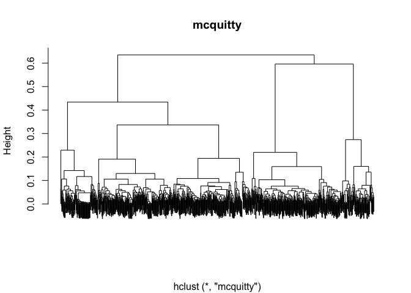

Dimensionality reduction and Cluster Analysis-Hierarchical Clustering
================
Yuan Xia
24/02/2020

``` r
library(RColorBrewer)
library(cluster)
library(pvclust)
library(xtable)
library(limma)
library(plyr)
library(lattice)
library(RCurl)
options(download.file.method = "curl")
library(GEOquery)
library(knitr)
library(pheatmap)
library(tidyverse)
```

### Input Data

``` r
load("GSE70213.Rdata")

# Get expression data
data <- exprs(geo_obj)

# Get covariate data
prDes <- pData(geo_obj)[, c("organism_ch1", "title", colnames(pData(geo_obj))[grep("characteristics", 
    colnames(pData(geo_obj)))])]

## Clean up covariate data
colnames(prDes) = c("organism", "sample_name", "tissue", "genotype", "sex", "age")
prDes$tissue = as.factor(gsub("tissue: ", "", prDes$tissue))
prDes$genotype = as.factor(gsub("genotype: ", "", prDes$genotype))
prDes$sex = as.factor(gsub("Sex: ", "", prDes$sex))
prDes$age = gsub("age: ", "", prDes$age)

sprDat <- t(scale(t(data)))
str(sprDat, max.level = 0, give.attr = FALSE)
```

    ##  num [1:35557, 1:24] -0.2042 0.9693 -0.0693 -0.3329 -0.7671 ...

``` r
round(data.frame(avgBefore = rowMeans(head(data)), avgAfter = rowMeans(head(sprDat)), 
    varBefore = apply(head(data), 1, var), varAfter = apply(head(sprDat), 1, var)), 
    2)
```

    ##          avgBefore avgAfter varBefore varAfter
    ## 10338001   2109.42        0 110944.28        1
    ## 10338002     55.62        0     70.82        1
    ## 10338003    645.76        0  22386.92        1
    ## 10338004    280.43        0   7513.48        1
    ## 10338005      2.92        0      0.02        1
    ## 10338006      3.64        0      0.07        1

``` r
data_to_plot = sprDat
# compute pairwise distances
pr.dis <- dist(t(data_to_plot), method = "euclidean")

# create a new factor representing the interaction of tissue type and genotype
prDes$grp <- with(prDes, interaction(tissue, genotype))
summary(prDes$grp)
```

    ##    quadriceps.control        soleus.control quadriceps.nebulin KO 
    ##                     6                     6                     6 
    ##     soleus.nebulin KO 
    ##                     6

## Pheatmap Clustering Plot

Regenerate the pheatmap clustering plot for the top genes, selected from
limma, using clustering distance: correlation, and clustering method:
mcquitty.

First we ge the top genes from limma

``` r
cutoff <- 1e-05
DesMat <- model.matrix(~grp, prDes)
dsFit <- lmFit(sprDat, DesMat)
dsEbFit <- eBayes(dsFit)
dsHits <- topTable(dsEbFit, coef = grep("grp", colnames(coef(dsEbFit))), p.value = cutoff, n = Inf)
numBHhits <- nrow(dsHits)

topGenes <- rownames(dsHits)

# Scaled data of topGenes
topDat <- sprDat[topGenes, ]
```

Then we plot the pheatmap for the `topDat`, using coorelation as cluster
distance and mcquitty as clustering method.

``` r
# set pheatmap clustering parameters
clust_dist_col = "correlation" 
clust_method = "mcquitty" 
clust_scale = "none"  

## the annotation option uses the covariate object (prDes) we defined. It should
## have the same rownames, as the colnames in our data object (data_to_plot).

pheatmap(topDat, cluster_rows = TRUE, scale = clust_scale, clustering_method = clust_method, 
    clustering_distance_cols = clust_dist_col, show_colnames = T, show_rownames = F, 
    main = "Clustering heatmap for top genes", annotation = prDes[, c("tissue", "genotype", 
        "grp")])
```

<!-- -->

## Dendrograms for top genes

Regenerate the dendrogram on the samples of this heatmap using the
hclust and dist functions.

``` r
data_to_plot = topDat
# compute pairwise distances
pr.dis <- dist(t(data_to_plot), method = "euclidean")

# compute hierarchical clustering using different linkage types
pr.hc.s <- hclust(pr.dis, method = "single")
pr.hc.c <- hclust(pr.dis, method = "complete")
pr.hc.a <- hclust(pr.dis, method = "average")
pr.hc.w <- hclust(pr.dis, method = "ward.D")

# plot them
op <- par(mar = c(0, 4, 4, 2), mfrow = c(2, 2))

plot(pr.hc.s, labels = FALSE, main = "Single", xlab = "")
plot(pr.hc.c, labels = FALSE, main = "Complete", xlab = "")
plot(pr.hc.a, labels = FALSE, main = "Average", xlab = "")
plot(pr.hc.w, labels = FALSE, main = "Ward", xlab = "")
```

<!-- -->

## PCA

Plot the data for this analyses along PCs 1 and 2 using ggplot instead
base plotting. Color the points by tissue

``` r
pcs <- prcomp(topDat, center = FALSE, scale = FALSE)
plot_data <- as.data.frame(cbind(prDes,pcs$rotation))


ggplot2::ggplot(plot_data, aes(x = PC1, y = PC2, color = tissue)) +
  geom_point() +
  theme_bw()
```

<!-- -->
